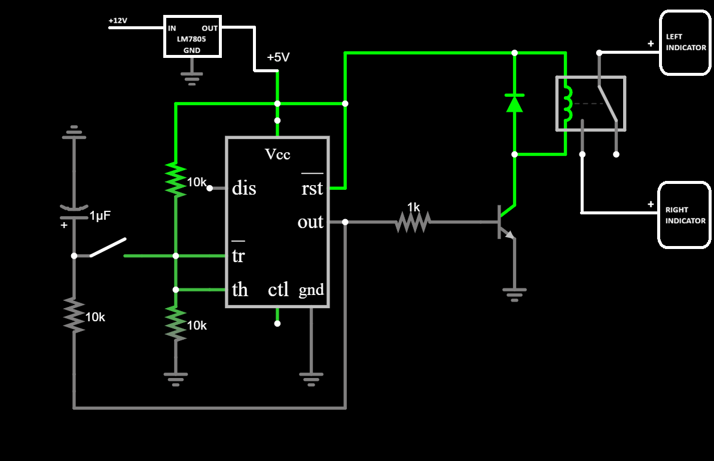

# 555-Timer Toggle Relay Module (Motorcycle Hazard Light Controller)

A robust, analog toggle switch system designed for automotive environments. This project uses an NE555 timer and an S8050 NPN transistor to control a 12V relay, specifically optimized for the "chaotic" electrical environment of a TVS Raider motorcycle.

## Features
- **One-Button Toggle:** Single push-button interface to switch the relay state.
- **Transistor Driven:** S8050 NPN transistor handles the relay coil current to protect the IC.
- **Automotive Grade Stability:** Includes decoupling capacitors and a Pin 5 reference filter to handle ignition noise.
- **Debounced Input:** RC network (100kΩ/1µF) prevents mechanical switch bounce from causing double-triggers.

## Circuit Diagram

## Components Used
- **IC:** NE555 Timer
- **Transistor:** S8050 (NPN)
- **Relay:** 12V DC Relay (or 5V if using a regulator)
- **Diode:** 1N4007 (Flyback protection)
- **Resistors:** 10kΩ (x2), 100kΩ, 1kΩ (Base resistor)
- **Capacitors:** 1µF (Feedback), 10nF (Pin 5 decoupling), 100µF (Power smoothing)

## Implementation on TVS Raider
The circuit is designed to be tapped into the **Orange (Switched DC)** wire for power. To ensure longevity, an LM7805 voltage regulator is recommended to stabilize the 12V-14.5V fluctuations from the stator.

## Lessons Learned
- **Switch Bounce:** Initial prototypes suffered from double-clicking. Solved by adjusting the RC feedback loop to a 1-second time constant.
- **Back-EMF:** Added 1N4007 flyback diode to prevent inductive spikes from the relay coil from damaging the S8050 transistor.
- **EMI Management:** Motorcycle ignition systems create significant EMF; added a capacitor to Pin 5 to stabilize the internal comparator reference.

## Author
Mohammed Fawaz Ali
Robotics Enthusiast & Engineering Student
